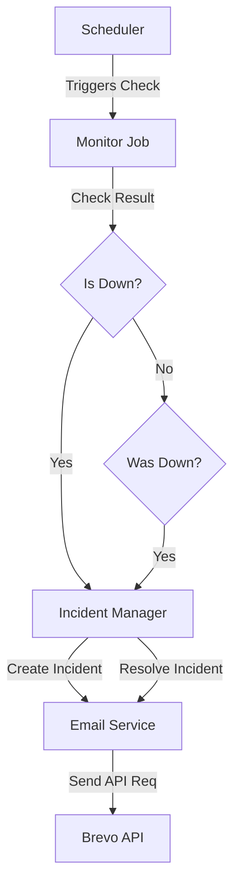

# Email Notification System

This document provides a comprehensive guide to the email notification system in the Uptime Monitor. The system is designed to send transactional alerts via Brevo when monitors experience downtime or recovery.

## Architecture

The email system is a module within the application that integrates closely with the Scheduler and Incident management systems.

### Key Components

1.  **Email Service** (`internal/modules/email/service.go`): 
    - Wraps the Brevo Go SDK.
    - Handles retry logic and exponential backoff.
    - Formats HTML email templates.
    - Resolves recipient email from the specific Monitor's owner.

2.  **Monitor Job** (`internal/scheduler/monitor_job.go`):
    - Orchestrates the check.
    - Decides *when* to trigger an email (e.g., only on new incident creation or resolution).
    - Fetches the `UserEmail` association to ensure the alert goes to the correct user.

## Features

-   **User-Specific Alerts**: Emails are sent to the specific user who owns the monitor, not a generic admin list.
-   **Reliability**: Built-in retry mechanism for Brevo API calls (configurable attempts and backoff).
-   **Spam Prevention**: 
    -   **Idempotency**: Alerts only trigger on state *changes* (Open/Resolve).
    -   **Cooldown**: Configurable cooldowns to prevent flapping noise.
-   **Sandbox Mode**: Ability to run in "dry-run" mode where emails are logged but not actually sent.

## Configuration

The system is configured entirely via environment variables.

| Variable | Description | Default |
| :--- | :--- | :--- |
| `BREVO_API_KEY` | Your Brevo (Sendinblue) API Key | Required |
| `BREVO_SANDBOX_MODE` | If `true`, logs emails to stdout instead of sending | `false` |
| `BREVO_API_BASE_URL` | API endpoint for Brevo | `https://api.brevo.com` |
| `ALERTS_ENABLED` | Master switch to enable/disable all alerts | `true` |
| `ALERT_FROM_EMAIL` | The email address shown as sender | `uptimemetrics@gmail.com` |
| `ALERT_FROM_NAME` | The name shown as sender | `Uptime Monitor` |
| `ALERT_REPLY_TO_EMAIL` | Reply-to address | `no-reply@uptime.local` |
| `ALERT_MAX_RETRIES` | Number of retries for failed API calls | `3` |
| `ALERT_RETRY_BACKOFF_SECONDS` | Seconds to wait between retries | `30` |
| `ALERT_COOLDOWN_MINUTES` | Minimum time between similar alerts | `30` |

## How It Works

### Incident Open
1.  A monitor fails its HTTP check.
2.  The scheduler checks for an existing open incident.
3.  If none exists, a **new incident** is created in the database.
4.  The system identifies the user who owns this monitor.
5.  An asynchronous call is made to `EmailService.SendIncidentOpened`.
6.  The service formats a "Down" template and attempts to send via Brevo.
7.  If Brevo fails, it retries up to `ALERT_MAX_RETRIES` times.

### Incident Resolve
1.  A failing monitor passes its HTTP check.
2.  The scheduler checks for an open incident.
3.  If one exists, it is marked as **resolved**.
4.  The system calculates the downtime duration.
5.  An asynchronous call is made to `EmailService.SendIncidentResolved`.
6.  The service formats an "Up" template with the duration and sends it.

## Troubleshooting

-   **Owner Email Not Found**: If a monitor exists but the associated user has no email or is deleted, the log will show `Cannot send incident email for [Monitor]: user email not found`.
-   **Brevo Errors**: Check logs for `failed to send email via Brevo`. Ensure your API key is correct and your account has credits.
-   **Sandbox Logs**: If `BREVO_SANDBOX_MODE=true`, search logs for prefix `[SANDBOX]`.

